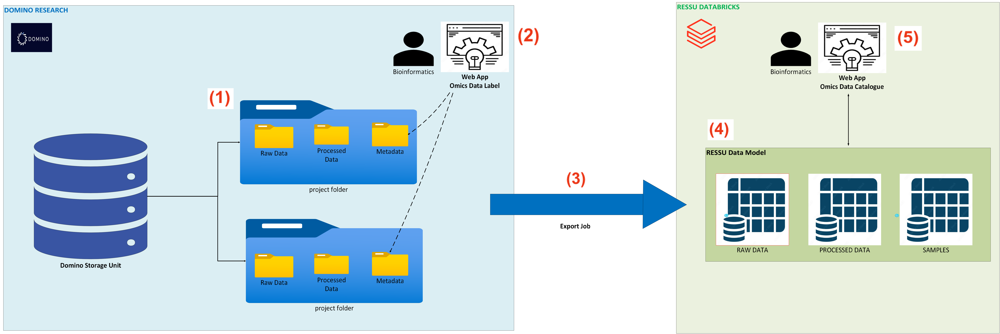

# Omics Data Catalogue Project Guide

This repository contains guidance for end users and developers working with the Omics Data Catalogue project at OrionPharma.

## Contents

- [Project Overview](#project-overview)
- [User Guide](#user-guide)
- [Developer Guide](#developer-guide)

## Project Overview

The Omics Data Catalogue project provides a catalogue for omics data at OrionPharma. This guide is the central place for project instructions for end users and developers.

*Overview of the Omics Data Catalogue architecture*

- **(1) Data Source**. Omics data are stored in Domino Research within project folders, each following a standardized subfolder structure.
- **(2) Omics Data Annotation**. Omics data are labelled by users through the _Omis Data Label_ web application.
- **(3) Sync to Data Model**. A scheduled Job exports Omics metadata files to the Ressu Databricks Lakehouse.
- **(4) Omics Data Model** Omics Metadata Files are ingested to the Omics Catalog data model.
- **(5) Omics Data Catalogue**. The Omics Data Catalogue web application enable users to query the catalogue.  

## User Guide

This section is for end users and will cover how to work with the Omics Data Catalogue.

## Developer Guide

This section is for developers and will cover how to work on and maintain the Omics Data Catalogue project.
